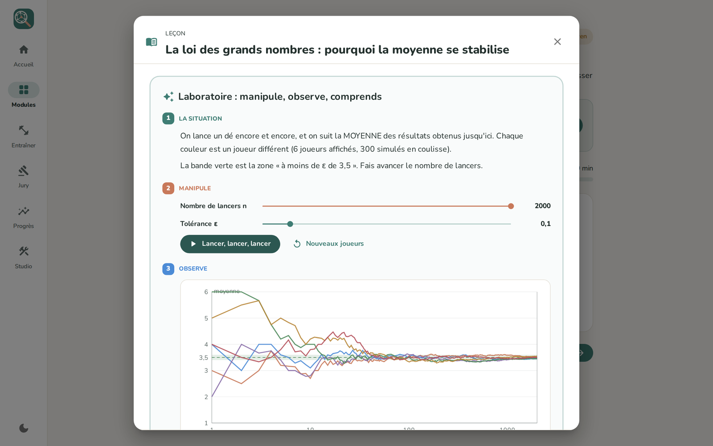
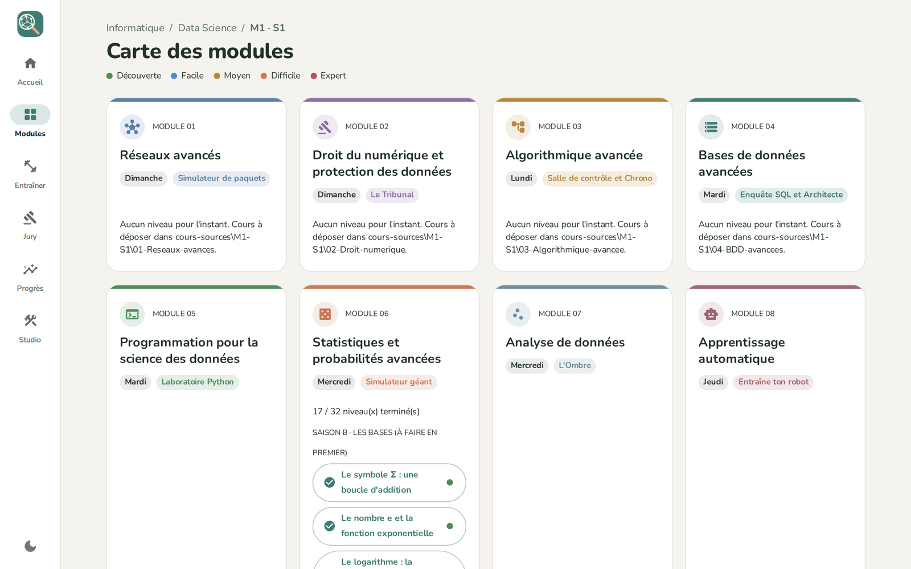
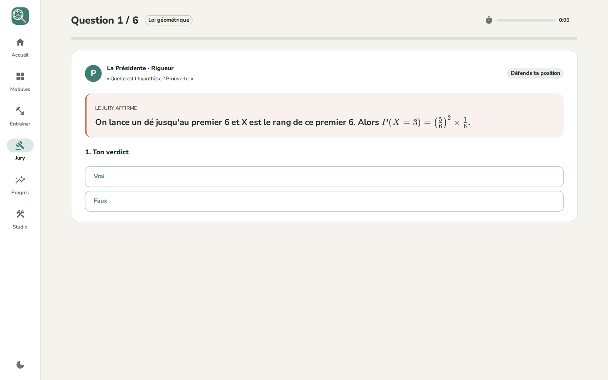
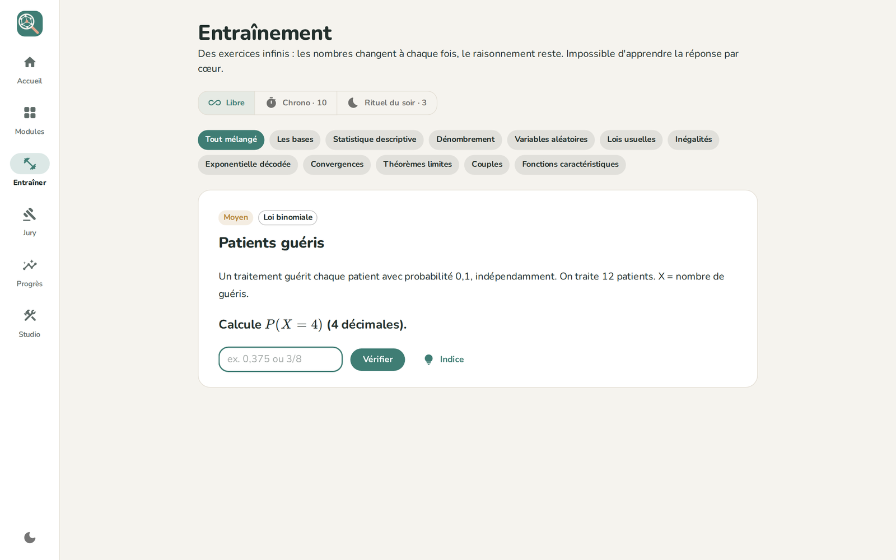
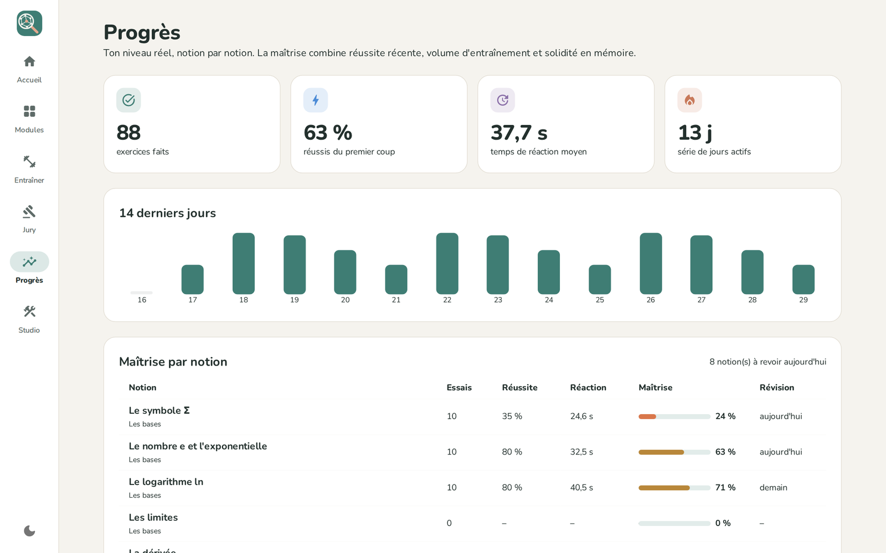

# 🔎 Enquêteur Data

### Comprendre ses cours de Master… comme on résout une enquête.

### ⬇️ Télécharger

**[💼 Version portable (5,5 Mo)](https://github.com/DEMBELE-ALHASSANE/Telechargements/releases/download/enqueteurdata-v0.8.0/EnqueteurData-v0.8.0-portable.exe)** · sans installation, même sur clé USB

**[📦 Installateur (2,7 Mo)](https://github.com/DEMBELE-ALHASSANE/Telechargements/releases/download/enqueteurdata-v0.8.0/EnqueteurData_0.8.0_x64-setup.exe)** · avec raccourci dans le menu Démarrer

---

## 💡 C'est quoi ?

Un logiciel pour **comprendre vraiment** les cours du Master Data Science, pas pour les apprendre par cœur.

Chaque notion devient une **enquête** : une situation de la vraie vie, une expérience à manipuler de ses mains, puis la formule qui l'explique. On ne demande jamais de retenir une formule avant d'avoir vu **pourquoi** elle existe.

## 🎯 Ce qui change tout

| Réviser à l'ancienne | Avec Enquêteur Data |
|---|---|
| On lit le polycopié et on espère | On **manipule** une expérience, puis on nomme ce qu'on a vu |
| Les exercices s'épuisent, on retient les réponses | Des exercices **infinis** : les nombres changent, le raisonnement reste |
| On oublie tout une semaine après | La **répétition espacée** ramène chaque notion juste avant l'oubli |
| Les explications sont trop denses | Chaque idée en **3 niveaux** : mots simples → avec des nombres → version maths |
| On découvre l'oral le jour J | Un **grand oral** simulé face à 3 jurés, noté sur 20 |

## 📦 Ce qu'il y a dedans

| | |
|---|---|
| 🗺️ **32 niveaux** | Répartis en 8 saisons, des bases (Σ, e, ln, dérivée, intégrale) jusqu'au théorème central limite |
| 🧪 **32 laboratoires visuels** | Curseurs, simulations et graphiques animés : on voit la loi des grands nombres se produire sous ses yeux |
| ♾️ **45 générateurs d'exercices** | Chaque exercice est unique, avec indice, correction et décomposition pas à pas |
| ⚖️ **Mode Jury** | 129 questions d'oral sur 43 notions : défendre, trouver l'erreur, trouver le contre-exemple, expliquer à voix haute |
| 🌙 **Rituel du soir** | 3 exercices ciblés sur les notions les plus fragiles, en 10 minutes |
| 📈 **Suivi de progression** | Maîtrise notion par notion, série de jours, prochaines révisions |
| 📖 **Glossaire au survol** | Chaque mot technique s'explique en passant la souris dessus |

## 🖼️ Aperçu

| | |
|---|---|
|  |  |
| **La carte des modules** : les saisons, pas à pas | **Le grand oral** : 3 jurés, 4 épreuves, une note sur 20 |
|  |  |
| **L'entraînement infini** : libre, chrono ou rituel du soir | **Les progrès** : maîtrise, série et révisions à venir |

## 🚀 Démarrer en 3 étapes

1. **Télécharge** la version portable ou l'installateur (liens en haut de la page).
2. **Lance** le fichier. Si Windows affiche « Windows a protégé votre ordinateur », clique sur **Informations complémentaires**, puis sur **Exécuter quand même** : le logiciel n'est simplement pas encore signé numériquement.
3. **Commence** par *Modules → Statistiques et probabilités → Saison B · Les bases*.

## ❓ Questions fréquentes

| Question | Réponse |
|---|---|
| Faut-il Internet ? | Non. Tout fonctionne hors ligne. |
| Où est enregistrée ma progression ? | Sur l'ordinateur utilisé. Sur un autre PC, la progression repart de zéro. |
| Portable ou installateur ? | Portable pour essayer ou pour une clé USB, installateur pour l'utiliser tous les jours. |
| Ça marche sur Mac ou téléphone ? | Pas encore : Windows 10 et 11 uniquement pour l'instant. |

## 🆕 Journal des versions

| Version | Nouveautés |
|---|---|
| **0.8** | ⚖️ Mode Jury : grand oral simulé, 129 questions, note sur 20 et mention. Icône officielle et version téléchargeable |
| **0.7** | 👥 Saison Couples (loi jointe, loi conditionnelle) et saison Fonctions caractéristiques |
| **0.6** | 🪜 Leçons en 3 niveaux, glossaire au survol, saison des bases mathématiques |
| **0.5** | 📊 Convergences et théorèmes limites : loi des grands nombres, TCL, intervalle de confiance |
| **0.4** | 🧪 Laboratoires visuels interactifs pour chaque leçon |
| **0.3** | 💡 L'exponentielle décodée : 9 niveaux, démonstrations guidées |
| **0.2** | ♾️ Entraînement infini, rituel du soir, répétition espacée, page Progrès |
| **0.1** | 🎨 Première interface, mode clair et sombre |

## 🔭 Prochainement

- 📚 **Les autres modules du Master** : bases de données avancées, algorithmique avancée, programmation Python, analyse de données, apprentissage automatique, réseaux avancés, droit du numérique
- 🚗 **ParcAuto** : logiciel de gestion de parc automobile, bientôt téléchargeable ici

---

Conçu et développé par **Alhassane Dembele** · © 2026 · Tous droits réservés

